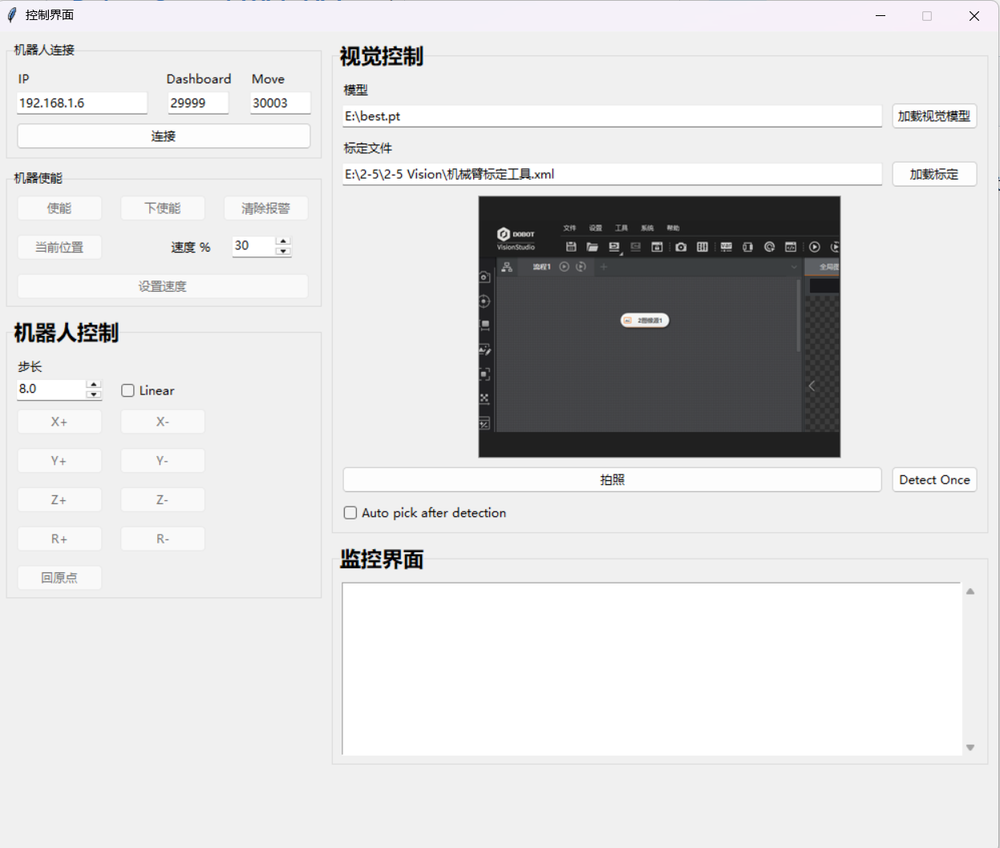

# 四轴机械臂联动视觉检测进行分拣、装配
使用越疆的四轴机器人，视觉采用yolov11。其中的姿态校正部分还不是很明白，目前属于有点懵逼的状态，由于J1+J4=R，用于姿态校正旋转的检验项。

初期的视频。由于最后比赛的时候没有录像，因此没能放上最后的成熟展示。

https://github.com/user-attachments/assets/2e7eb837-582e-4206-bf59-24fec4fd4f99.mp4

# 机械臂控制
主要通过DOBOT提供的接口，通过Python实现TCP通信，发送信号给机器人进行控制。
# 图形化控制界面
整个界面的搭建主要使用：Tkinter 库，最后的控制界面展示如下：

# 整个控制逻辑和功能
## 1.点动控制
控制机械臂在X\Y\Z方向上进行点动
## 2.控制机械臂根据视觉检测目标进行抓取
涉及手眼标定、视觉检测、仿射变换
## 3.将物件放入到凹槽里面，进行零件装配
涉及姿态校正，参考J1轴+J4轴=R轴角度。还纯在改进空间。目前只能是60%几率能够进行装配。

# 程序运行
```
进入：
Dobot-code\new_maincode\TCP-IP-4Axis-Python-main
运行：
new_main_code
视觉检测权重：
Dobot-code\new_maincode\TCP-IP-4Axis-Python-main\best.pt
数据集、标定转换（使用20mm的棋盘进行手眼标定）
```
